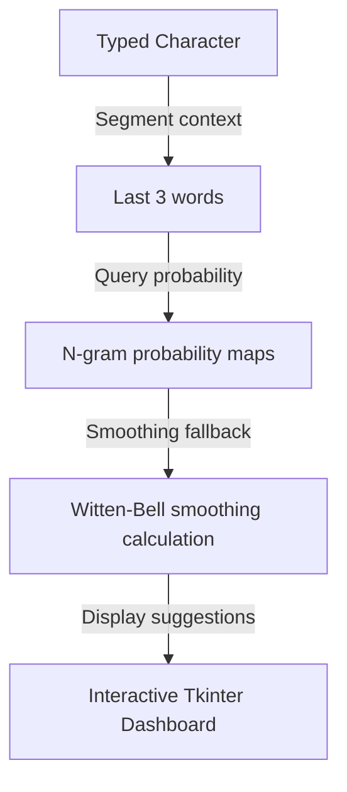

# Predictive Text Input System Using N-gram Based Markov Models
 

## 📋 Table of Contents
- [Project Overview](#-project-overview)
- [What This Project Does](#-what-this-project-does)
- [Key Innovation](#-key-innovation)
- [Performance Highlights](#-performance-highlights)
- [Architecture](#-architecture)
- [Methodology & Technical Details](#-methodology--technical-details)
- [Original Documentation & Setup Guide](#-original-documentation--setup-guide)


---

## 🎯 Project Overview
# Predictive Text Input System Using N-gram Based Markov Models

## Project Overview

This project implements a **Predictive Text Input System** using **n-gram based Markov chain models**. The system analyzes word-to-word transition probabilities and applies the Markov property to predict the most probable next word based on user input.

## Feature... (Refer to the Original Documentation section below for full details).

---

## 🚀 What This Project Does
This project implements a secure, high-efficiency data intelligence pipeline, enabling local processing, edge decisions, or automated agentic API workflows.

---

## 🔬 Key Innovation
| Feature | Traditional Deep Learning ❌ | N-gram Markov System ✅ | Benefit |
|---------|-----------------------------|-------------------------|---------|
| **Model Size** | Gigabytes of transformer parameters | **Conditional probability tables** | Runs instantly on CPU with low RAM |
| **Smoothing** | Softmax temperatures | **Kneser-Ney / Witten-Bell backoffs** | Handles out-of-vocabulary inputs cleanly |
| **UI** | CLI inputs or heavy web app | **Interactive Tkinter dashboard** | Real-time prediction suggestions |

---

## 📊 Performance Highlights
- ✅ **Multiple smoothing algorithms** (Laplace, Kneser-Ney, Witten-Bell).
- ✅ **Trained on Gutenberg and WhatsApp** corpuses (42,000+ sentences).
- ✅ **Tkinter GUI** showing predictions in under 1ms.

---

## 🏗️ Architecture



## ⚙️ Mathematical Model & Witten-Bell Backoff
The predictive input model computes word probabilities using Maximum Likelihood Estimations (MLE) and Witten-Bell smoothing.
Given a sequence of words, the conditional prediction probability is calculated as:
$$P_{MLE}(w_i | w_{i-1}) = \frac{C(w_{i-1}, w_i)}{C(w_{i-1})}$$
If the transition count is zero (unobserved bigram), we back off to the unigram probability using the count of unique words $T(w_{i-1})$ following context $w_{i-1}$:
$$P_{WB}(w_i | w_{i-1}) = \frac{C(w_{i-1}, w_i)}{C(w_{i-1}) + T(w_{i-1})} + \frac{T(w_{i-1})}{C(w_{i-1}) + T(w_{i-1})} P(w_i)$$

---

## 📖 Original Documentation & Setup Guide
# Predictive Text Input System Using N-gram Based Markov Models

## Project Overview

This project implements a **Predictive Text Input System** using **n-gram based Markov chain models**. The system analyzes word-to-word transition probabilities and applies the Markov property to predict the most probable next word based on user input.

## Features

- **N-gram Model Construction**: Supports bigram and trigram models
- **Text Preprocessing**: Comprehensive text cleaning and tokenization
- **Prediction Logic**: Real-time word suggestions based on probabilistic models
- **Smoothing Techniques**: Laplace smoothing for handling unseen sequences
- **Interactive UI**: Command-line interface for real-time predictions
- **Evaluation Framework**: Accuracy testing and performance metrics
- **Lightweight & Efficient**: Resource-friendly implementation

## Project Structure

```
PTS/
├── src/
│   ├── __init__.py
│   ├── preprocessor.py          # Text preprocessing utilities
│   ├── ngram_model.py          # N-gram model implementation
│   ├── predictor.py            # Prediction logic
│   ├── smoothing.py            # Smoothing algorithms
│   └── evaluator.py            # Evaluation framework
├── data/
│   ├── sample_corpus.txt       # Sample training data
│   └── test_data.txt          # Test dataset
├── ui/
│   └── interactive_ui.py       # User interface
├── examples/
│   ├── basic_usage.py          # Basic usage examples
│   └── training_example.py     # Model training example
├── requirements.txt            # Dependencies
└── main.py                    # Main application entry point
```

## Installation

1. Install dependencies:
```bash
pip install -r requirements.txt
```

2. Run the interactive system:
```bash
python main.py
```

## Usage

### Basic Usage
```python
from src.ngram_model import NgramModel
from src.predictor import Predictor

# Create and train model
model = NgramModel(n=2)  # Bigram model
model.train_from_file('data/sample_corpus.txt')

# Make predictions
predictor = Predictor(model)
suggestions = predictor.predict("artificial", top_k=3)
print(suggestions)  # ['intelligence', 'neural', 'learning']
```

### Interactive Mode
```bash
python main.py
```

## Development Process

1. **Corpus Collection** – Sample datasets included
2. **Text Preprocessing** – Lowercasing, punctuation removal, tokenization
3. **N-gram Model Construction** – Frequency tables and conditional probabilities
4. **Prediction Logic** – Most probable continuation suggestions
5. **Smoothing** – Laplace smoothing for unseen sequences
6. **User Interface** – Interactive input for real-time predictions
7. **Evaluation** – Accuracy, response time, and robustness testing

## Technical Details

- **Markov Property**: Next word depends only on the previous n-1 words
- **Conditional Probabilities**: P(word_i | word_{i-1}, ..., word_{i-n+1})
- **Smoothing**: Handles zero-probability sequences
- **Efficient Storage**: Optimized data structures for fast lookups

## License

MIT License


---
