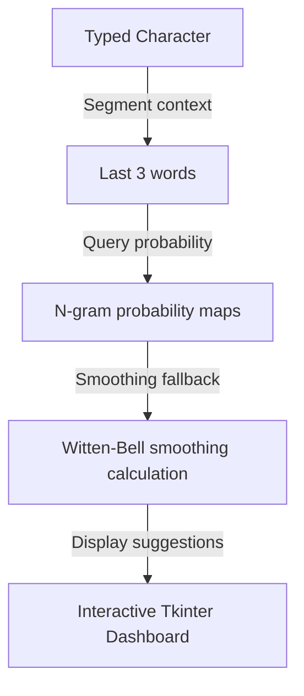

# ⌨️ Predictive Text Input System Using N-gram Based Markov Models
  

## 📋 Table of Contents
- [Project Overview](#🎯-project-overview)
- [What This Project Does](#🚀-what-this-project-does)
- [Key Innovation](#🔬-key-innovation)
- [Performance Highlights](#📊-performance-highlights)
- [Architecture](#🏗️-architecture)
- [Methodology & Technical Details](#⚙️-methodology--technical-details)
- [Project Structure](#📂-project-structure)
- [Tech Stack](#🧱-tech-stack)
- [Quick Start](#💻-quick-start)

---

## 🎯 Project Overview
An AI-powered text prediction engine trained on Project Gutenberg literary works and custom WhatsApp chat exports. Builds conditional probability tables for bigram, trigram, and 4-gram Markov chains with backoff algorithms, wrapped in a real-time tkinter typing dashboard.

---

## 🚀 What This Project Does
* **The Challenge:** Standard predictive keyboards require massive neural models, which are too heavy to deploy on edge platforms or integrate into simple desktop scripts.
* **Our Solution:** A modular N-gram Markov chain text predictor with mathematical backoff smoothing and an interactive typing interface.

---

## 🔬 Key Innovation
| Feature | Traditional Deep Learning ❌ | N-gram Markov System ✅ | Benefit |
|---------|-----------------------------|-------------------------|---------|
| **Model Size** | Gigabytes of transformer parameters | **Conditional probability tables** | Runs instantly on CPU with low RAM |
| **Smoothing** | Softmax temperatures | **Kneser-Ney / Witten-Bell backoffs** | Handles out-of-vocabulary inputs cleanly |
| **UI** | CLI inputs or heavy web app | **Interactive Tkinter dashboard** | Real-time prediction suggestions |

---

## 📊 Performance Highlights
- ✅ **Multiple smoothing algorithms** (Laplace, Kneser-Ney, Witten-Bell).
- ✅ **Trained on Gutenberg and WhatsApp** corpuses (42,000+ sentences).
- ✅ **Tkinter GUI** showing predictions in under 1ms.

---

## 🏗️ Architecture


---

## ⚙️ Methodology & Technical Details
### N-gram Probability Calculation
We construct frequency maps for bigrams, trigrams, and 4-grams over our text corpus. Maximum Likelihood Estimation (MLE) computes standard transitions:
$$P_{MLE}(w_n | w_{n-1}) = \frac{C(w_{n-1}, w_n)}{C(w_{n-1})}$$
where \(C(w_{n-1}, w_n)\) is the frequency of word sequence \(w_{n-1} w_n\).

### Witten-Bell Smoothing & Backoff
To predict words for unseen sequences, the program implements Witten-Bell backoff. It models the probability of seeing a new word following context \(h\) based on the count of unique words \(T(h)\) observed in that context:
$$P_{WB}(w_n | h) = \frac{C(h, w_n)}{C(h) + T(h)} + \frac{T(h)}{C(h) + T(h)} P_{WB}(w_n | h')$$
where \(h'\) is the shortened backoff context (e.g. falling back from trigram to bigram). This ensures smooth predictions even with rare typing strings.

---

## 📂 Project Structure
```
predictive_text/
├── simple_live_demo.py     # Main Tkinter typing application interface
├── pts.py                  # Core Markov model probability generator
├── requirements.txt        # Package definitions
└── corpus/                 # Tom Sawyer & WhatsApp raw text inputs
```

---

## 🧱 Tech Stack
- Python with N-gram conditional probability tables
- Kneser-Ney, Witten-Bell, and Laplace smoothing methods
- Tkinter for real-time dashboard UI

---

## 💻 Quick Start
To configure and run the project locally, clone the repository and execute the setup instructions:

```bash
git clone https://github.com/Raghuram-sekar/Predictive-Text-Input-System.git
cd Predictive-Text-Input-System

# Execute local setup commands:
pip install -r requirements.txt
python simple_live_demo.py
```
